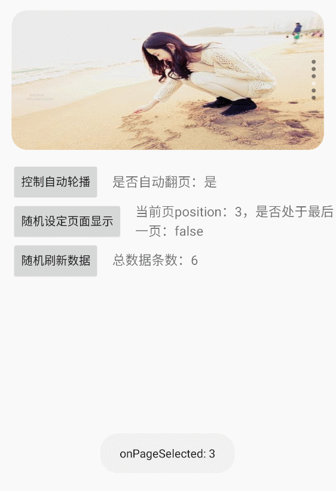

# X-FlyBanner
## 本项目fork自([Bigkoo/Android-ConvenientBanner](https://github.com/Bigkoo/Android-ConvenientBanner))，在此基础上进行了相关优化及实现项目中需求。

### fly-banner
[  ](https://bintray.com/weixia/maven/x-flybanner/_latestVersion)
```groovy
compile 'me.xia:x-flybanner:1.1.4'
```

### 效果图：



### 配置：
```kotlin
    fun setDefault(flyBanner: FlyBanner<Any>,
                   datas: List<Any>,
                   isHorizontal: Boolean,
                   isLoopMode: Boolean,
                   isScaleCardView: Boolean,
                   onItemClickListener: OnItemClickListener?,
                   onPageChangeListener: OnPageChangeListener?) {

        val dataSize = datas.size
        val indicatorAlign = if (isHorizontal) PageIndicatorAlign.ALIGN_RIGHT_BOTTOM else PageIndicatorAlign.ALIGN_RIGHT_CENTER
        val indicatorOrientation = if (isHorizontal) PageIndicatorOrientation.HORIZONTAL else PageIndicatorOrientation.VERTICAL
        val orientation = if (isHorizontal) PageOrientation.HORIZONTAL else PageOrientation.VERTICAL

        flyBanner
                //设置 banner 视图数据初始化
                .setPages(HolderCreator(), datas)
                //设置 banner 是否无限循环播放
                .setPageLoopMode(isLoopMode)
                //设置 banner 翻页方向
                .setPageOrientation(orientation)
                //设置 viewPager 圆角
                .setPageRadius(20)
                //配置卡片式缩放视图
                .setScaleCardView(isScaleCardView, 0.1f, 0.85f)
                //banner 配置生成
                .pageBuild()
                //设置指示器样式
                .setIndicatorId(intArrayOf(R.drawable.indicator_gray_radius, R.drawable.indicator_white_radius))
                //设置指示器位置，默认为右下角
                .setIndicatorAlign(indicatorAlign)
                //设置指示器方向，默认为横向
                .setIndicatorOrientation(indicatorOrientation)
                //设置指示器偏移
                .setIndicatorMargin(15)
                //设置指示器间距
                .setIndicatorSpacing(3)
                //设置指示器是否显示
                .setIndicatorVisible(dataSize > 1)
                //指示器生成
                .indicatorBuild()
                //设置自动轮播时间
                .start(3000)
                //设置是否进行自动轮播
                .setAutoPlay(dataSize > 1 && isLoopMode)
                //设置点击事件监听
                .setOnItemClickListener(onItemClickListener)
                //设置页面切换事件监听
                .setOnPageChangeListener(onPageChangeListener)
    }
```

```xml
    <com.xia.flybanner.FlyBanner
        android:id="@+id/main_banner"
        android:layout_width="0dp"
        android:layout_height="0dp"
        android:layout_margin="15dp"
        app:fb_indicatorAlign="align_rightCenter"
        app:fb_indicatorMargin="15dp"
        app:fb_indicatorOrientation="vertical"
        app:fb_indicatorShow="true"
        app:fb_indicatorSpacing="3dp"
        app:fb_pageAutoPlay="false"
        app:fb_pageAutoTurningTime="3000"
        app:fb_pageLoopMode="false"
        app:fb_pageOrientation="vertical"
        app:fb_pageRadius="20dp"
        app:layout_constraintBottom_toBottomOf="@+id/main_blur_view"
        app:layout_constraintDimensionRatio="h,8:4"
        app:layout_constraintLeft_toLeftOf="parent"
        app:layout_constraintRight_toRightOf="parent"
        app:layout_constraintTop_toTopOf="@+id/main_blur_view"/>
```


## *特别感谢*
* [Android-ConvenientBanner](https://github.com/Bigkoo/Android-ConvenientBanner)
* [RecyclerViewBanner](https://github.com/Mr-XiaoLiang/RecyclerViewBanner)
