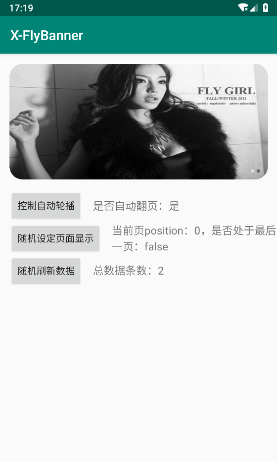

# X-FlyBanner
## 本项目fork自([Bigkoo/Android-ConvenientBanner](https://github.com/Bigkoo/Android-ConvenientBanner))，在此基础上进行了相关优化及实现项目中需求。

### 效果图：



#### 配置：
```java
    public static void setDefault(final FlyBanner<Integer> flyBanner,
                                  final ArrayList<Integer> datas,
                                  final OnItemClickListener onItemClickListener,
                                  final OnPageChangeListener onPageChangeListener) {

        flyBanner
                //设置视图数据初始化
                .setPages(new HolderCreator(), datas)
                //设置指示器可见性，默认为可见状态
//                .setIndicatorVisible(datas.size() > 1)
                //设置指示器样式
//                .setIndicatorId(new int[]{R.drawable.indicator_gray_radius, R.drawable.indicator_white_radius})
                //设置指示器位置，默认为右下角
//                .setIndicatorAlign(PageIndicatorAlign.ALIGN_RIGHT_BOTTOM)
                //设置指示器方向，默认为横向
//                .setIndicatorOrientation(PageIndicatorOrientation.HORIZONTAL)
                //设置指示器偏移
//                .setIndicatorMargin(30)
                //指示器配置使用
                .useIndicator()
                //设置翻页效果
//                .setLayoutManager(new LinearLayoutManager(flyBanner.getContext()))
                //设置 viewPager 圆角
                .setRadius(50)
                //设置自动轮播时间
                .start(5000)
                //设置是否进行自动轮播
//                .setCanLoop(datas.size() > 1)
                //设置点击事件监听
                .setOnItemClickListener(onItemClickListener)
                //设置页面切换事件监听
                .setOnPageChangeListener(onPageChangeListener);
    }
```

#### 调用：
```java
    private void loadData() {
        mLocalImages.clear();
        final int min = 1;
        final int max = 7;
        final int randomNum = new Random().nextInt(max - min) + min;

        //本地图片集合
        for (int position = 0; position < randomNum; position++) {
            final int imgResId = getResId("ic_test_" + position, R.drawable.class);
            if (imgResId != -1) {
                mLocalImages.add(imgResId);
            }
        }

        BannerCreator.setDefault(mFlyBanner, mLocalImages, position ->
                        Toast.makeText(MainActivity.this, "onItemClick: " + position, Toast.LENGTH_SHORT).show(),
                new OnPageChangeListener() {
                    @Override
                    public void onScrollStateChanged(RecyclerView recyclerView, int newState) {
                    }

                    @Override
                    public void onScrolled(RecyclerView recyclerView, int dx, int dy) {
                    }

                    @Override
                    public void onPageSelected(int index, boolean isLastPage) {
                        Toast.makeText(MainActivity.this, "onPageSelected: " + index, Toast.LENGTH_SHORT).show();
                        setCurItemPos(index, isLastPage);
                    }
                });

        setLoopStatus();
        setCurItemPos(0, mLocalImages.size() <= 1);
        setDataSize(mLocalImages.size());
    }
```

#### 详情请见 demo

*感谢原作者的贡献*